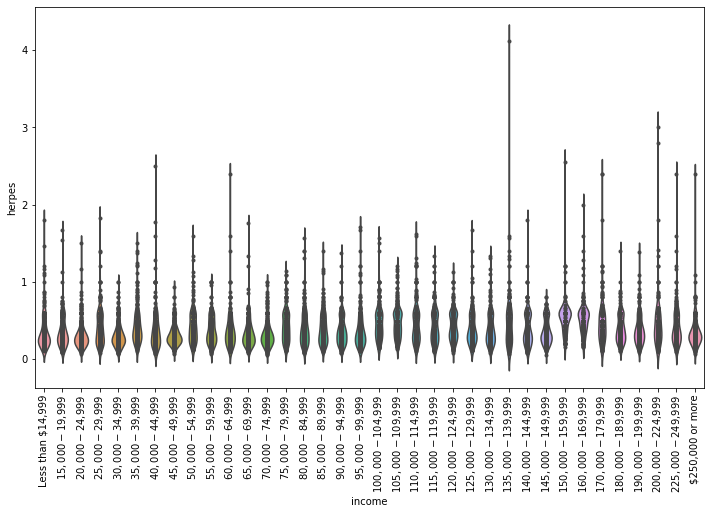

# Understanding the Factors Influencing STD Prevalance
In this repository is the data analysis our group performed for the [2019 Stanford Blueprint Datathon](https://blueprint-datathon.weebly.com/about.html), a weekend-long hackathon focusing on data science in healthcare. Although this was our first foray into the world of data science, our team placed amongst the top 4 teams for the competition. Our [final presentation](Datathon_Presentation.pdf) is attached for those interested.

Completed by Yiran Liu, Quenton Bubb, Sai Gourisankar, Jeremy Binagia.

## Key Findings
It is well-known that sexually transmitted diseases are increasing in prevalence within a broad set of unique communities across the United States. A key goal of public health infrastructure is to identify and characterize populations that are vulnerable or at higher risk of contracting these sometimes life-threatening diseases in order to minimize harm and maximize positive health outcomes. Analysis of demographic data can often reveal subsets of populations that can benefit from targeted interventions that reflect their needs. Here, we’ve analyzed a large set of demographic and STD diagnostic data across the United States with the goal of identifying an underserved population that may be at high risk of contracting an STD. Due to statistical concerns regarding the sample sizes of each distinct demographic, we decided to focus on a subset of cohorts (individuals over 65 years of age) in a defined geographical location (California). As the geriatric population rapidly increases in size across the US, medical and public health infrastructure must concurrently evolve to accommodate their needs. Due to literature reports of additional public health risks and concerns regarding the elderly population, we explored these cohorts in order to try to recapitulate or add additional depth to our understanding of sexually transmitted disease risks and demographic factors that pertain to these individuals.

By visualizing the dataset in a variety of ways, we found several initial trends. First, through the use of violin plots (Fig. 1 and Fig. 2), we ruled out gender and income as strong predictors for STD prevalence. Interestingly enough, we found that STD rates were much higher for those who attend graduate school, as shown in Fig. 3 and Fig. 4.


*Figure 1: There is no correlation between gender and herpes disease status within this data set, contrary to government reported data (similar plots were created for all STDs and were not shown here for brevity since they show qualitatively the same trend).*


*Figure 2: Across income distributions, there is no apparent income bracket alone that is at particular risk (similar plots were created for all STDs and were not shown here for brevity since they show qualitatively the same trend).*

For our statistical analysis, we ran a multiple linear regression over all the gender, income, and education categories within the 65+ cohorts in California. We first encoded each categorical value as a 0 or 1 for subsequent analyses (i.e. one-hot encoding). After converting the categories in this way, we ran a simple linear regression where the dependent variable, y, was the prevalence of each STD, and X was a vector of all the other independent demographic variables. We tested the null hypothesis, for each independent variable in X, that its coefficient was 0, and obtained a p-value for that test. In addition, we obtained a Bonferroni-corrected significance level accounting for multiple-hypothesis testing by dividing a threshold of 0.05 by the number of independent demographic variables and compared the p-values of each coefficient to that threshold. This analysis led us to exclude, for each STD, any variable associated with a coefficient not significantly different than zero; i.e. the variation in that STD could not be explained by the independent variable.
From this analysis, we observed the following. First, for most STDs, either low or high incomes did not significantly explain prevalence, whereas middle incomes did. This could let us, or other researchers, high and low incomes into one or two buckets, e.g. $< \$40,000$ and $> \$75,000$. However, this might reflect the challenges of collecting data from low-income and very high-income people, rather than inherent variation. Additionally, some STDs, such as trich and parasitic, had too much missing data to allow any of the demographic variables by themselves to explain much of the variance. We also found through our regression that gender did not matter statistically, which is contrary to government-reported data (not included in this analysis) and probably reflects the internal biases of the data construction.


*Figure 3: Education level within the 65+ cohort reveals potential risk factors, namely among those who went to graduate school*


*Figure 4: Prevalence over time for the cohort corresponding to 65 - 74 years old in the $70,000 - $74,999 income bracket (the cohort with the most recorded data). Herpes prevalence is greatest for those who attended graduate school (similar trends are seen for females, as shown in our slides).*

## Installation and Usage
We encourage others to view the analysis we performed during the weekend of the datathon, although the data files themselves *should not be used for other studies* as described in more detail below.
- Activate a virtual environment and install the required libraries, e.g.:
```shell
virtualenv -p python .env
source .env/bin/activate
pip install -r requirements.txt
```
- The Jupyter notebooks are organized as follows:
  - [violin_plots.ipynb](https://github.com/jbinagia/blueprint-datathon/blob/master/violin_plots.ipynb): used to create the [violin plots](https://en.wikipedia.org/wiki/Violin_plot?oldformat=true) found in slides 4 - 6 of our [final presentation](Datathon_Presentation.pdf).
  - [line_plots.ipynb](https://github.com/jbinagia/blueprint-datathon/blob/master/violin_plots.ipynb): used to create the line plots shown in slides 7 and 8 of our [presentation](Datathon_Presentation.pdf).
  - [regression.ipynb](regression.ipynb) : used for the hypothesis testing described in slides 9 - 11 of the [presentation](Datathon_Presentation.pdf).
- Note that for legal purposes as described in the [case description](https://blueprint-datathon.weebly.com/the-case.html) the original datasets **should not be used outside of the datathon**. They have been left here solely so that others may view the data processing and analysis performed by the group during the original datathon time period.

## Further Details on the Motivation for the Case
As discussed on the [official case description](https://blueprint-datathon.weebly.com/the-case.html) for the 2019 Blueprint Datathon, repeated here for convenience:

> Over the last decade, STD rates have steadily been on the rise, with over 2 million new infections reported each year. In the United States alone, the developing STD epidemic has totaled over $16 billion of medical expenses annually, with younger demographics representing the majority of cases. Students in high school and college acquire 50% of new STDs. The Center for Disease Control and Prevention has reported an all-time high in STD cases in 2017, despite recent research suggesting an average decrease in sexual activity across the US. Rates of Gonorrhea diagnoses have increased by nearly 67% over the past few years, with little to no signs of stopping. Syphilis and Chlamydia have shown similarly steep increases in overall diagnoses rates. In some cases, STDs can develop into more serious, lethal infections. Though many of these infections can be cured with antibiotics, many still go undiagnosed and/or untreated. The resulting adverse health effects include ectopic pregnancies, increased HIV risk, and stillbirth. Other serious concerns include the rise of antibiotic resistant STDs, some of which have been shown to resist almost all classes of antibiotics.

> The Center for Disease Control and Prevention has reported an all-time high in STD cases in 2017, despite recent research suggesting an average decrease in sexual activity across the US. Rates of Gonorrhea diagnoses have increased by nearly 67% over the past few years, with little to no signs of stopping. Syphilis and Chlamydia have shown similarly steep increases in overall diagnoses rates.

> In some cases, STDs can develop into more serious, lethal infections. Though many of these infections can be cured with antibiotics, many still go undiagnosed and/or untreated. The resulting adverse health effects include ectopic pregnancies, increased HIV risk, and stillbirth. Other serious concerns include the rise of antibiotic resistant STDs, some of which have been shown to resist almost all classes of antibiotics.

> Although this epidemic has gained attention from doctors, public health/policy experts, and media over recent years, significant progress has yet to be made. Causes of any of these trends are unclear.

Thus, the goal for the participants of this hackathon was to understand what predictors if any may be related to or the cause of this rise in STD prevalence.
